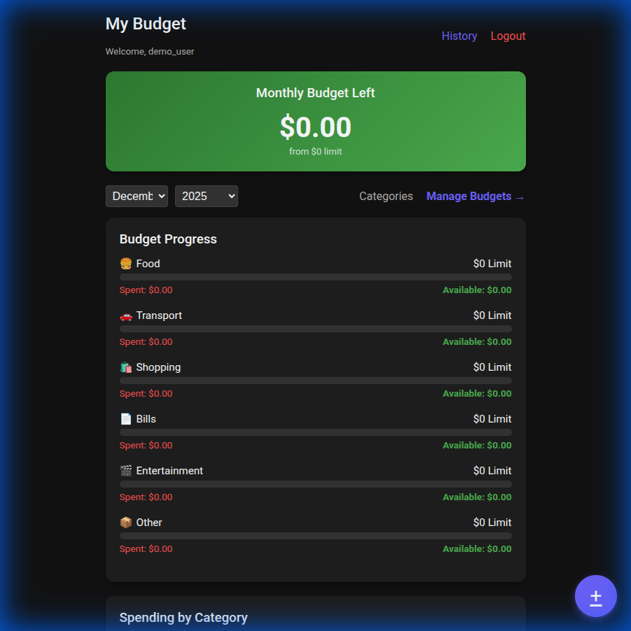
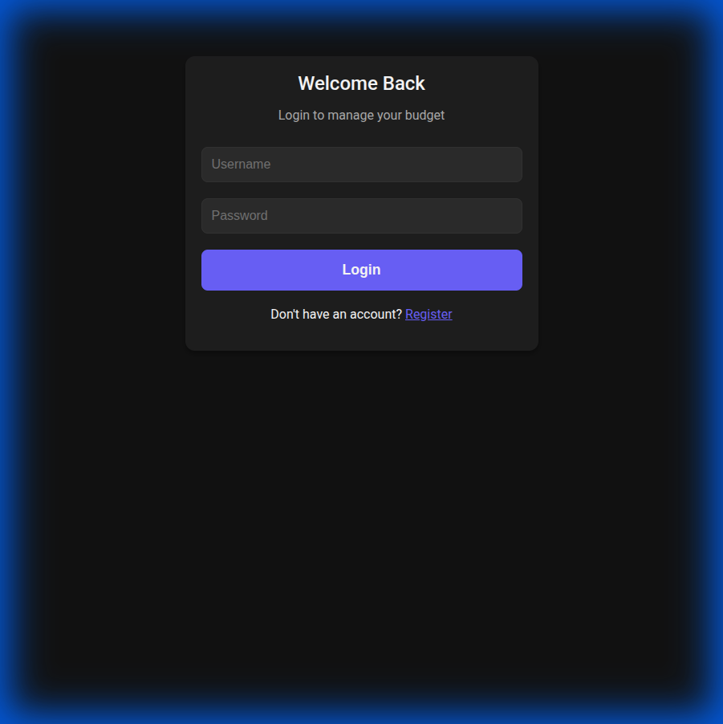

# 💰 Mobile-First Budget App

A modern, mobile-friendly personal budgeting application built with **Flask**. Track your expenses, set monthly limits, and visualize your financial health with ease.



## ✨ Features

-   **📱 Mobile-First Design**: Optimized for use on your phone.
-   **📊 Dashboard Overview**: See your monthly budget left, spending by category, and recent transactions at a glance.
-   **📅 Monthly Budgets**: Set custom budget limits for each category.
    -   **Selectable Month**: Plan ahead by setting budgets for future months (up to 2035!).
    -   **Smart Copy**: Easily copy budget limits from the previous month.
-   **🏷️ Custom Categories**: Create categories with custom names, colors, and icons.
-   **🔐 Secure Authentication**: User registration and login to keep your data private.
-   **📈 Visualizations**: Interactive charts to analyze your spending habits.
-   **🐳 Docker Ready**: Easy deployment with Docker and Docker Compose.

## 🚀 Quick Start

### Prerequisites

-   Docker & Docker Compose

### Installation

1.  **Clone the repository:**
    ```bash
    git clone https://github.com/toniok2nd/budget.git
    cd budget
    ```

2.  **Start the application:**
    ```bash
    docker-compose up --build
    ```

3.  **Access the app:**
    Open your browser and navigate to `http://localhost:5000`.

## 📸 Screenshots

### Login Page


### Dashboard


## 🎥 Demo

Watch a quick demo of the registration and login flow:


## 🛠️ Technology Stack

-   **Backend**: Python, Flask, SQLAlchemy
-   **Frontend**: HTML, CSS (Mobile-First), JavaScript, Chart.js
-   **Database**: SQLite (Development) / Easily scalable
-   **Containerization**: Docker

---
*Built with ❤️ for better financial health.*
